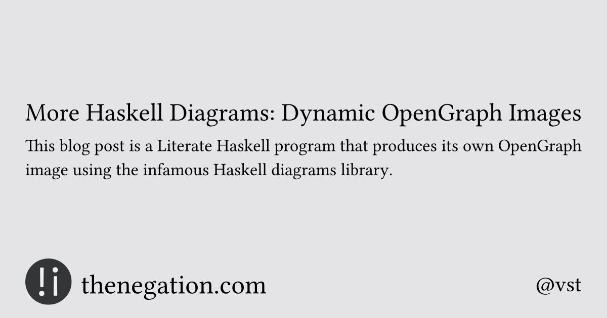

This blog post is a Literate Haskell program that produces its own OpenGraph
image using the infamous Haskell [diagrams] library.

<!-- more -->

## Motivation

So far, I have written a few blog posts about generating images with Haskell's
[diagrams] library. In this blog post, I will try to combine these blog posts
into a superpower: Generating OpenGraph images dynamically including the title
and description of the blog post.

## Program

Before we start, one important warning: You may find the code below not very
well composed. The reason is that I am still getting to know the [diagrams]
library and its capabilities. I am also limiting my time to write these blog
posts. Eventually, I will get better at both and revisit these blog posts.

We will use the 4 Haskell packages for this Literate Haskell program like
before: [diagrams], [diagrams-cairo], [SVGFonts] and [markdown-unlit].

Let's import our modules of interest:

```haskell
import Diagrams.Backend.Cairo
import Diagrams.Prelude
import qualified Graphics.SVGFonts as F
import qualified Graphics.SVGFonts.Wrap as F.Wrap
import Data.Maybe (fromMaybe)
import System.Environment (getArgs)
```

Let's implement our entry point what will read the command line argument for
output directory, my Website logo and render the OpenGraph image:

```haskell
main :: IO ()
main = do
  dir <- head <$> getArgs
  logo <- loadLogo
  render dir "og.png" (og logo "thenegation.com" "@vst" title description)
  where
    render dpath fname =
      renderCairo (dpath <> "/" <> fname) (mkSizeSpec2D (Just 1200) (Just 630))
```

This is how we will run our blog post:

```sh
runhaskell -pgmLmarkdown-unlit index.lhs .
```

Now, the first thing we need is the OpenGraph title and description. Normally,
we would parse it from the YAML metadata (or front-matter) of the Markdown file.
But, let's hard-code it to focus into the [diagrams] part in this blog post:

```haskell
title :: String
title =
  "More Haskell Diagrams: Dynamic OpenGraph Images"

description :: String
description =
  "This blog post is a Literate Haskell program that produces its own OpenGraph image using the infamous Haskell diagrams library."
```

We will also need the Website logo:

```haskell
loadLogo :: IO (Diagram B)
loadLogo = do
  (Right img) <- loadImageEmb "../../../static/android-chrome-512x512.png"
  pure $ scaleUToX 10 $ image img
```

We will compose the OpenGraph as 3 different segments:

1. The title
2. The description
3. The Website logo, URL and author

Both title and description can be long text, and we may need to wrap them. Here
is our function to do it:

```haskell
textWrapped :: Double -> (Double, Double) -> String -> Diagram B
textWrapped height bounds txt =
  final <> boundingRect (frame 0 final) # lwO 0 # value mempty
  where
    mLines = F.Wrap.wrapText def height [(F.Wrap.splitAtSpaces, bounds)] txt
    putTxt = lw none . fc black . F.set_envelope . F.svgText def
    final = vsep 0.2 (fmap putTxt (fromMaybe ["what happened?"] mLines))
```

Let's prepare the title:

```haskell
ogiTitle :: String -> Diagram B
ogiTitle t =
  textWrapped 1 (14, 16) t
```

Now, the description:

```haskell
ogiDescription :: String -> Diagram B
ogiDescription d =
  textWrapped 1 (20, 25) d
```

The footer is going to contain the website logo, URL and author:

```haskell
ogiFooter :: Diagram B -> String -> String -> Diagram B
ogiFooter l u a =
  hsep 0 $
    [ center $ clipBy (circle 5) l
    , center $ rect 2 1 # lw none
    , center $ u # F.svgText def # F.fit_width 40 # F.set_envelope # lw none # fc black
    , center $ rect 58 1 # lw none
    , center $ a # F.svgText def # F.fit_width 10 # F.set_envelope # lw none # fc black
    ]
```

Let's put them together. Note how we rescale both title and description to `120`
units first:

```haskell
og :: Diagram B -> String -> String -> String -> String -> Diagram B
og l u a t d =
    (scaleUToX 110 $ center final) <> (rect 120 63 # bg (sRGB24read "#e4e4e7") # lw none)
  where
    content =
        center . vsep 1 $
            [ centerXY $ scaleUToX 120 $ ogiTitle t
            , centerXY $ scaleUToX 120 $ ogiDescription d
            ]
    footer = centerXY $ ogiFooter l u a
    final = (content `atop` (rect 120 53 # lw none)) === footer
```



## Wrap-Up

For a long time, I wanted to play with the [diagrams] library. I am glad that I
finally did it with this and the previous blog posts. I understood the library
good enough to create an OpenGraph image dynamically.

I think that there are some things quite difficult or tedious to achieve with
the [diagrams] library. But, I also think that most of this difficulty is
because of my lack of experience with the library. I am looking forward to
getting better at it.

<!-- REFERENCES -->

[diagrams]: https://diagrams.github.io
[cairo]: https://cairographics.org
[diagrams-cairo]: https://hackage.haskell.org/package/diagrams-cairo
[markdown-unlit]: https://hackage.haskell.org/package/markdown-unlit
[SVGFonts]: https://hackage.haskell.org/package/SVGFonts
[wrapText]:
  https://hackage.haskell.org/package/SVGFonts/docs/Graphics-SVGFonts-Wrap.html#v:wrapText
